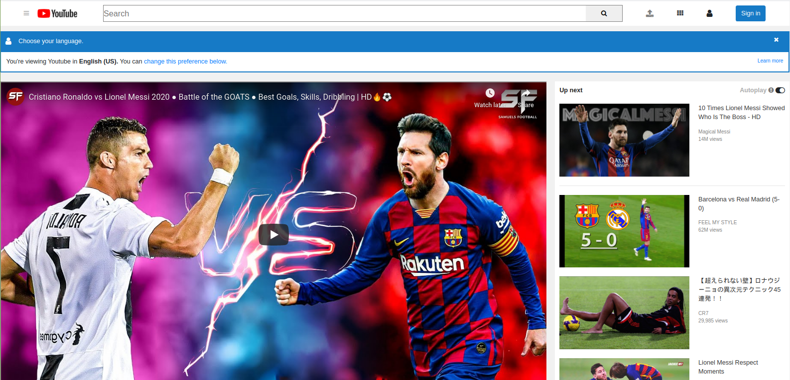

# Godwin-Rashid-Youtube-Page

This is project which focuses on cloning the exact design of youtube start page with just html and css only. Come and follow the instructions to  download the source code and experience it so that I bet you will never notice any variation from the actual youtube page.

Additional description about the project and its features.

## Built With

- Major languages - HTML & CSS
- Icons Used - Fontawesome
- Video Taken - Youtube Page 

## Live Demo

[Live Demo Link]( https://gnwin.github.io/Godwin-Rashid-Youtube-Page)

## Getting Started

To get a local copy up and running follow these simple example steps.

### Prerequisites

- At least have a system with 4GB of RAM and 128 GB of free external memory.
- Be sure to download all the components.
- An IDE, ideally vscode or atom.

### Setup

- Clone this repo by using the extension.
- Download vscode.

### Install

- Install vscode.
- Install the live server extension in the vscode.

### Usage

- Open the folder where this project is cloned.

### Run tests

- Click the live server button that is placed on the bottom of the page.

### Deployment

It can be deployed any server.

## Authors

👤 **Author1**

- Github: [@rashidmvk](https://github.com/rashidmvk)
- Twitter: [@rashidnm](https://twitter.com/rashidnm)
- Linkedin: [@rashidmvk](https://linkedin.com/in/rashidmvk)

👤 **Author2**

- Github: [@Gnwin](https://github.com/Gnwin)
- Twitter: [@gmarxr](https://twitter.com/gmarxr)
- Linkedin: [n-gwin](https://linkedin.com/in/n-gwin)

## 🤝 Contributing

Contributions, issues and feature requests are welcome!

Feel free to check the [issues page](https://github.com/Gnwin/Godwin-Rashid-Youtube-Page/issues).

## Show your support

Give a ⭐️ if you like this project!

## Acknowledgments

- Thanks to Microverse for giving us this opportunity to work on this project.
- Hat tip to anyone whose code was used.
- Inspiration.
- etc.

## 📝 License

This project is [GR](lic.url) licensed.